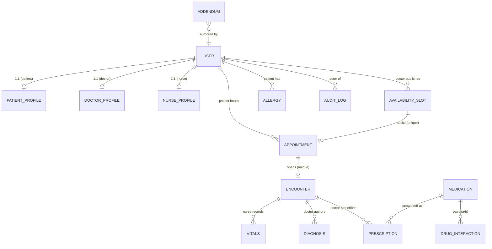

# Data model — entity-relationship diagram

The persisted entities and how they relate. Rationale for the non-obvious choices
follows the diagram. Matches the models under `backend/app/models/` and the 9
Alembic migrations (chain head `f8d94a046c95`).

## Rationale for non-obvious choices
- **1:1 role profiles (shared PK).** `*_profile.user_id` is both PK and FK to
  `users.id`, guaranteeing at most one profile per user and keeping `users`
  focused on identity/auth. Clinical FKs target `users.id` directly (e.g. a slot's
  `doctor_id`) so scheduling never has to join a profile.
- **Slot ↔ Appointment is 1:1 via `unique(slot_id)`.** This is the last-line
  double-booking guard (§5.2): even under a race, at most one appointment can
  reference a slot.
- **Appointment ↔ Encounter is 1:1 via `unique(appointment_id)`.** The appointment
  is the *plan*; the encounter is the *record* of the visit that happened.
- **Addendum is polymorphic** (`target_type`,`target_id`) rather than a FK per
  clinical entity — one correction table annotates encounters, diagnoses, vitals
  (append-only, §5.6).
- **DrugInteraction is an unordered pair** with a unique `(a,b)` constraint; the
  service looks up either column. Allergies match a medication **name or class**.
- **AuditLog FKs use `SET NULL`** (not CASCADE) so deleting a user never erases
  the history of what they did; `actor_id` is nullable for unauthenticated events
  (failed login). Clinical/scheduling FKs mostly CASCADE from the patient, except
  slot/medication which use RESTRICT so referenced rows can't vanish under a
  booking/prescription.
- **Append-only clinical rows.** No entity here is edited/deleted in place by the
  app; see ADR-0002.

## Tables (16)
`users`, `patient_profiles`, `doctor_profiles`, `nurse_profiles`,
`availability_slots`, `appointments`, `encounters`, `vitals`, `diagnoses`,
`addenda`, `medications`, `allergies`, `drug_interactions`, `prescriptions`,
`audit_logs`, plus Alembic's `alembic_version`.
