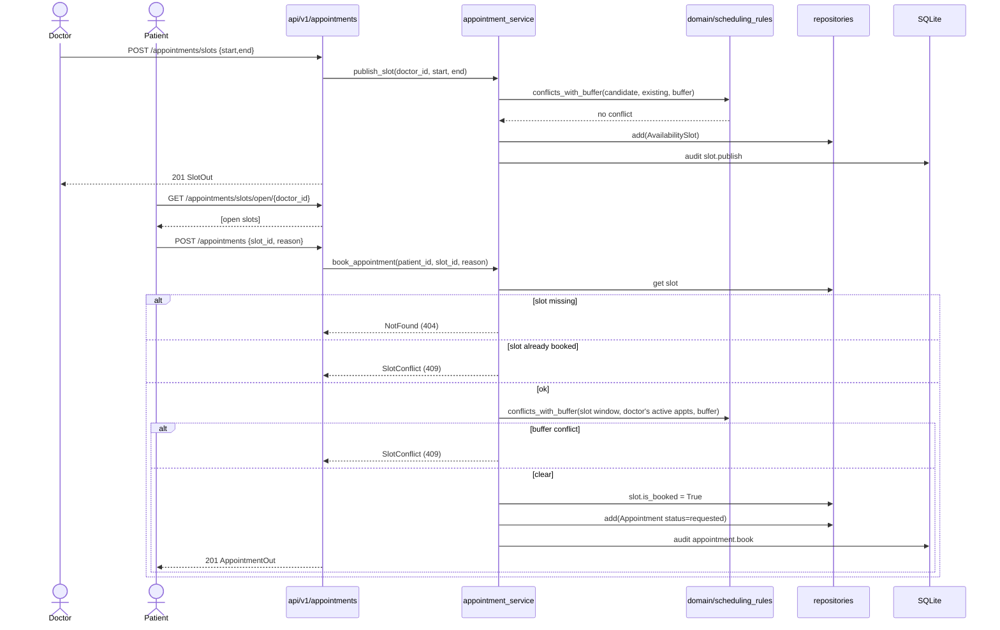

# Workflow — Appointment booking (stories B1–B3)

How a patient books a doctor's published slot, and the checks that run. See
[business-rules.md](../domain/business-rules.md) Rule #2 for the conflict/buffer
reasoning.

## Sequence

## Notes
- **Two conflict checks:** publishing rejects a slot overlapping the doctor's
  booked time; booking re-checks at commit time. The unique `slot_id` constraint
  is the final race guard (Rule #2).
- **Web path:** the HTMX booking page (`/appointments/book`) posts to the same
  service and swaps in a confirmation/error partial — identical behavior, HTML
  instead of JSON.
