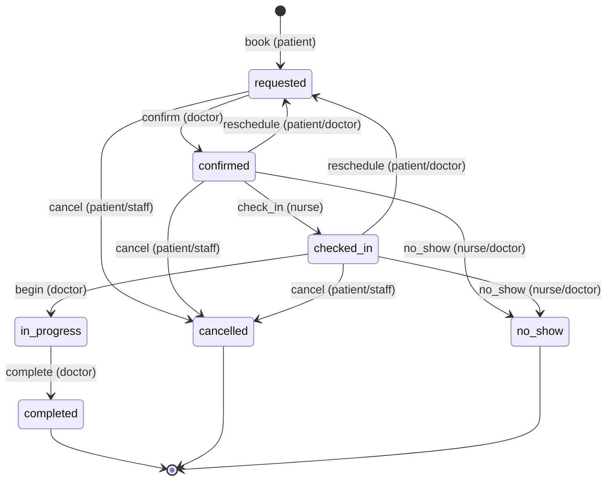
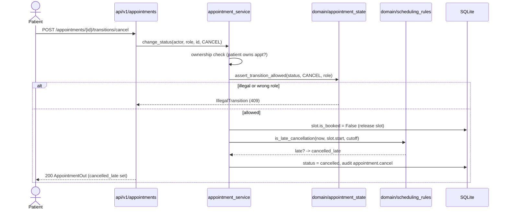

# Workflow — Appointment lifecycle: cancel & no-show (stories B4, B6)

How an appointment advances through its states after booking, and the two exit
branches (cancel, no-show). See [business-rules.md](../domain/business-rules.md)
Rule #1 for the full transition table and role gating.

## State diagram

## Cancel sequence (with late flag + slot release)

## Notes
- **Ownership** is a *fine* check (a patient may cancel only their own
  appointment) that the coarse role gate cannot express — hence it lives in the
  service, not `require_roles`.
- **Cancelling releases the slot** (`is_booked=False`) so it can be re-booked; a
  late cancel is *flagged*, never blocked (Rule #2).
- **No-show** is staff-only (nurse/doctor) and, unlike cancel, does **not** free
  the slot — a no-show still consumed the reserved time.
