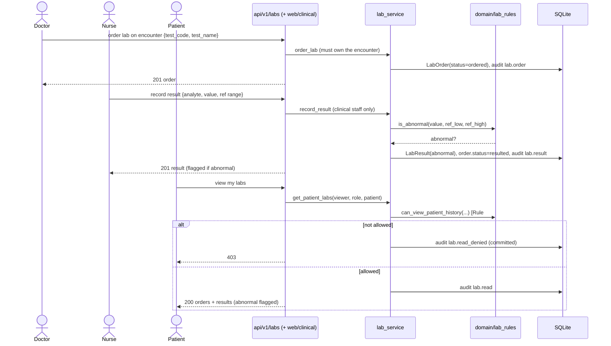

# Workflow — Lab order → result → review (v2 M8)

The cross-role lab flow. See [business-rules.md](../domain/business-rules.md)
Rule #9 (flagging + visibility) and Rule #3 (treating-relationship scoping).

## Sequence

## Notes
- **Three roles, three permissions:** owning doctor orders; any clinical staff
  records; viewing is scoped (patient=own, treating doctor, nurse; admin none).
- **Append-only:** recording adds result rows and flips the order to `resulted`;
  nothing is edited in place.
- **Web:** doctor orders/reviews on the encounter page; nurse works the
  `/clinical/labs/queue`; patient sees `/clinical/labs`. All HTMX partial swaps.
