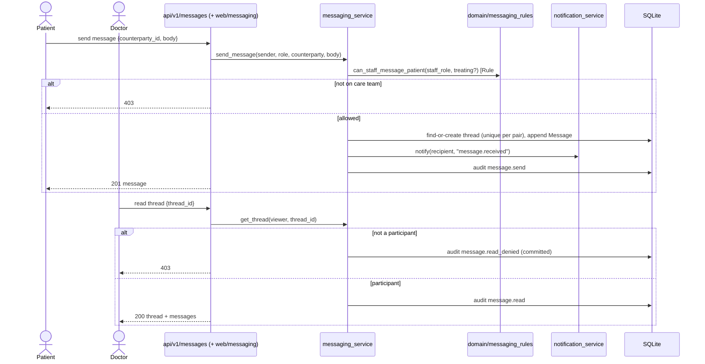

# Workflow — Care-team messaging & notifications (v2 M9)

Patient ↔ care-team messaging, plus the in-app notifications raised by domain
events. See [business-rules.md](../domain/business-rules.md) Rule #10 (messaging
scope + notifications) and Rule #3 (treating-relationship scoping).

## Sequence — send & read a message



## Sequence — event → notification → feed

```mermaid
sequenceDiagram
    participant Svc as appointment / lab / prescription service
    participant NSvc as notification_service
    participant DB as SQLite
    actor User

    Svc->>NSvc: notify(user, event_type, message, link)
    NSvc->>DB: Notification(read_at=null)  [same unit of work as the event]

    User->>NSvc: list feed / mark read / mark all read
    NSvc->>DB: scoped to user_id; read sets read_at
```

## Notes
- **Care-team scope, reused not reinvented:** the staff side of a thread must pass
  the same §5.3 relationship the history/lab reads use — doctor needs a treating
  relationship, nurse may message any patient, admin never participates.
- **One thread per pair:** a `UniqueConstraint(patient_id, staff_id)` keeps a
  conversation continuous; a "new" message to an existing correspondent reuses it.
- **Notifications are a derived read-model:** emitted best-effort inside the
  event's unit of work (event + alert commit together); the recipient may mark
  them read, but they are never otherwise edited.
- **Web:** inbox at `/messages`, a conversation at `/messages/{id}` (HTMX reply
  swap), notification feed at `/notifications` (HTMX mark-read swaps). Sidebar
  links added for patient/doctor/nurse.
