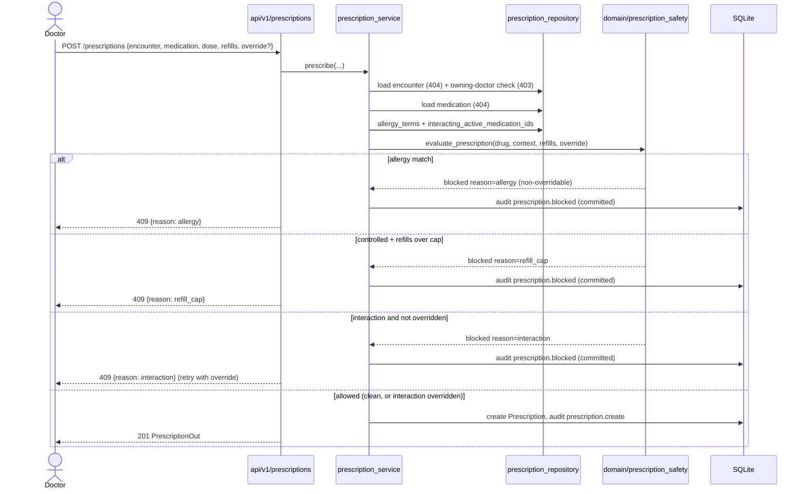

# Workflow — Prescribing with safety checks (stories D1–D5)

How a doctor prescribes within an encounter and how the §5.4 safety checks gate
it. See [business-rules.md](../domain/business-rules.md) Rule #4.

## Sequence

## Notes
- **Severity ladder:** allergy (absolute) > refill cap > interaction (overridable).
  Allergy is evaluated first so it can never be bypassed by an override.
- **Blocks are audited too** (`prescription.blocked`, committed independently) —
  an attempted unsafe prescription is itself a recordable event.
- **Web path:** the encounter page's prescribe form (`/clinical/encounters/{id}/
    prescriptions`) posts to the same service and swaps in the prescriptions list
  partial, showing the block reason inline; the override checkbox retries.
