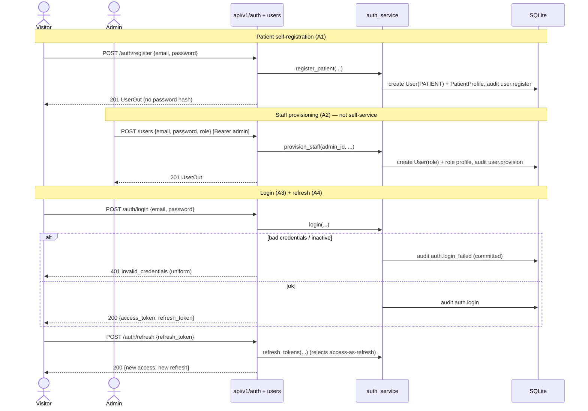

# Workflow — Registration & login (stories A1–A4)

How accounts are created and how sessions are established, across both the JSON
API and the server-rendered UI. See
[ADR-0003](../adr/ADR-0003-authentication-and-authorization.md).

## Sequence

## Notes
- **Only patients self-register;** staff are admin-provisioned with an explicit
  role (a PATIENT role is rejected). Mirrors a real clinic.
- **Uniform failure:** unknown email and wrong password return the *same* 401, so
  the API doesn't reveal which emails exist. Deactivated accounts also fail here.
- **Two transports, one identity:** the API uses `Authorization: Bearer`; the web
  UI carries the access token in an HttpOnly `hv_access` cookie set at
  `POST /login`. Both resolve via `get_current_user`.
- **Token types are enforced:** an access token can't be used where a refresh is
  required, or vice versa.
- Every outcome — including failures — is audited (§5.7).
