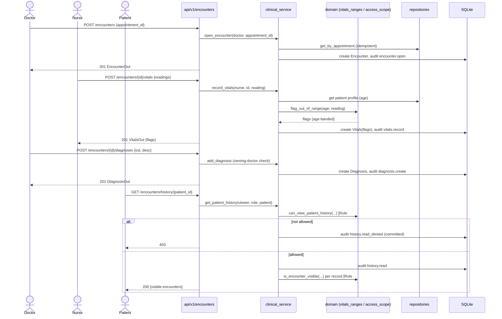

# Workflow — Triage → consultation (stories C1–C5)

The clinical visit: from a nurse recording vitals to a doctor diagnosing, with
the scoping and immutability rules that govern it. See
[business-rules.md](../domain/business-rules.md) #3 (scoping), #5 (vitals), #6
(append-only), #8 (consent).

## Sequence

## Notes
- **Roles:** nurse records vitals; doctor opens/diagnoses; corrections are
  addenda (append-only, Rule #6). No one edits or deletes a clinical record.
- **Two gates on reads:** history-level access (Rule #3) then per-record consent
  (Rule #8). Denials are audited.
- **Age drives flags:** the same vitals value can be normal or abnormal depending
  on the patient's age (Rule #5).
