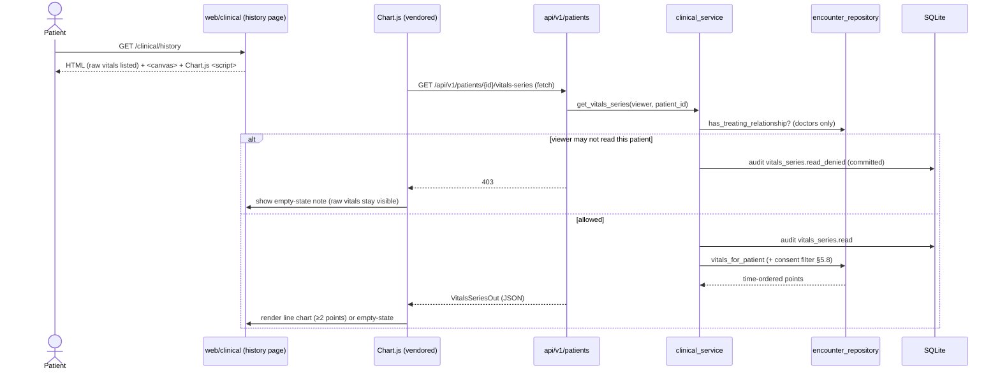

# Workflow — Vitals trend charts (§15, M13)

How a patient's recorded vitals become a line chart over time on the medical-history
page. See [business-rules.md](../domain/business-rules.md) Rule #12 and
[ADR-0007](../adr/ADR-0007-client-charting-vendored-chartjs.md).

## Sequence

## Why it is shaped this way
- **Same read rule as history (Rule #12).** A chart is another PHI read; it reuses
  `can_view_patient_history` + the §5.8 consent gate, so it can never expose more
  than the history page beside it. Audited like any history read (Rule #7).
- **Server owns the data; the library only draws (ADR-0007).** Authorization,
  scoping, and clinical meaning are server-side; Chart.js just renders the JSON.
- **Progressive enhancement.** The raw vitals are listed server-side, so a blocked
  script, a fetch error, or < 2 data points degrades to an empty-state note — never
  a blank page and never hidden clinical data.
- **No build step.** Chart.js is vendored as one static file (like HTMX/Pico),
  loaded only on charting pages via the base template's `head_extra` block.

## Entry points
- **API:** `GET /api/v1/patients/{patient_id}/vitals-series` → `VitalsSeriesOut`
  (nurse/treating-doctor/own-patient; admin denied).
- **Web:** the medical-history page (`web-my-history`) renders the chart canvas +
  the vendored `chart.umd.min.js`.
